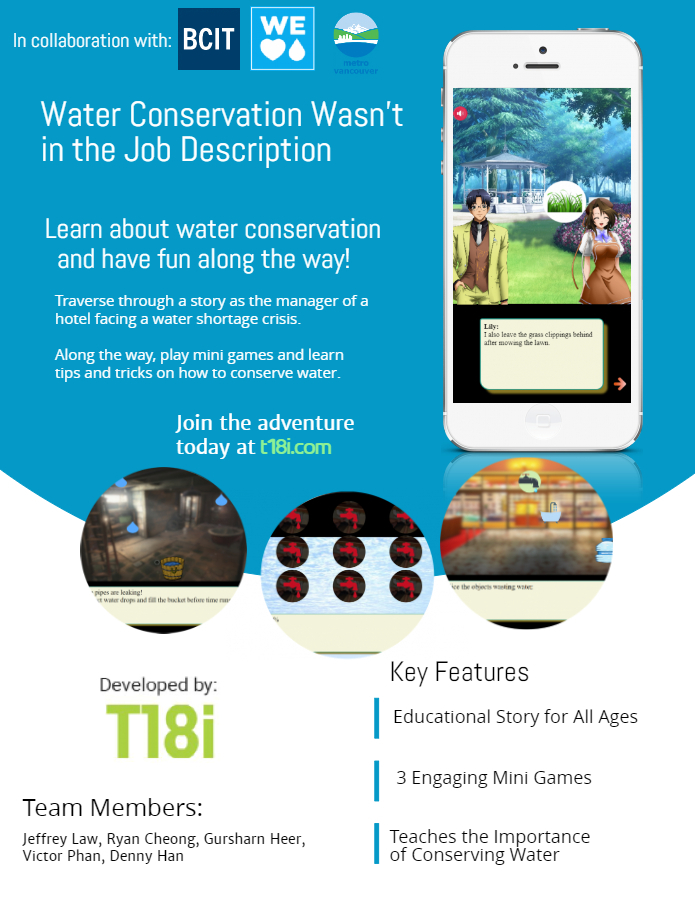

# Water Conservation Wasn't in the Job Description

Water Conservation Wasn't in the Job Description (or WCWITJD) is a web app that seeks to educate the end user about water conservation through the means of a story. The user plays through the story as the manager of a hotel facing a water shortage crisis. Along the way, mini-games must be completed and tips and tricks on how to conserve water are discussed.

<p align="center">

</p>

## Built With

* [HTML](https://en.wikipedia.org/wiki/HTML)
* [CSS](https://en.wikipedia.org/wiki/Cascading_Style_Sheets)
* [JavaScript](https://en.wikipedia.org/wiki/JavaScript)
* [jQuery](https://jquery.com/)
* [Bootstrap](https://getbootstrap.com/)
* [MySQL](https://www.mysql.com/)
* [PHP](http://www.php.net/)

## Percentage Completion
95%

```
Several bugs exist and the front page design could be improved upon.
```

## Known Bugs

1. Clicking the next arrow too rapidly can cause the fading animation to run twice.

2. If you change orientation during the game, it does not show a prompt to change the orientation back portrait mode.

3. Audio continues playing on mobile even when the browser is minimized. 


## Initial Deployment

Our web application uses GlowHost for the name registrar and web hosting.


### Challenges as a group
The challenges we faced as a group can be divided into technical and non-technical. Technical challenges rose from having a non-modular structure for our code. Ryan, Victor, and Jeffrey would often have to work closely together to combine code and make adjustments according to the design. Much of the code was located in a single JavaScript file which made changes from different team members, complicated to incorporate.

Non-technical challenges came from certain team members having difficulty working in a team environment. As a result, changes were made to the style of project management. Instead of having each member provide input on a certain task, members were assigned certain tasks and assumed all control and responsbility for their assigned tasks.


## Versioning

We use [Github](https://github.com/) for version control. For the network graph, see the [insights page](https://github.com/jeffreylaw/comp2910project/network). 

## Authors

See the list of [contributors](https://github.com/jeffreylaw/comp2910project/graphs/contributors) who participated in this project.

* **Jeffrey Law** - [jeffreylaw](https://github.com/jeffreylaw)
* **Victor Phan** - [Victor-Phan](https://github.com/Victor-Phan)
* **Ryan Cheong** - [RyanCheong123](https://github.com/RyanCheong123)
* **Gursharn Heer**
* **Denny Han**

## Acknowledgments

* Thanks to BCIT, Metro Vancouver, and all the instructors in COMP 2910 for the opportunity to take part in this project.


